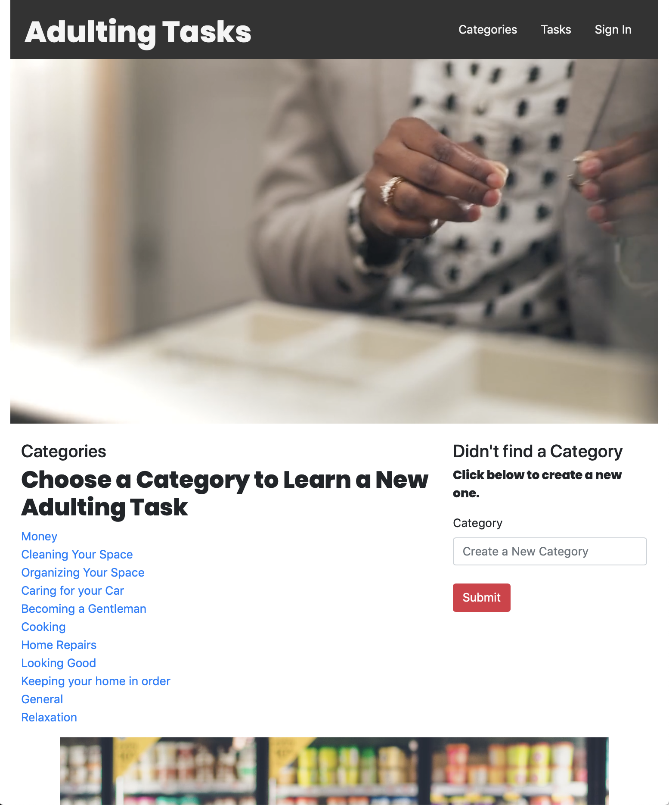
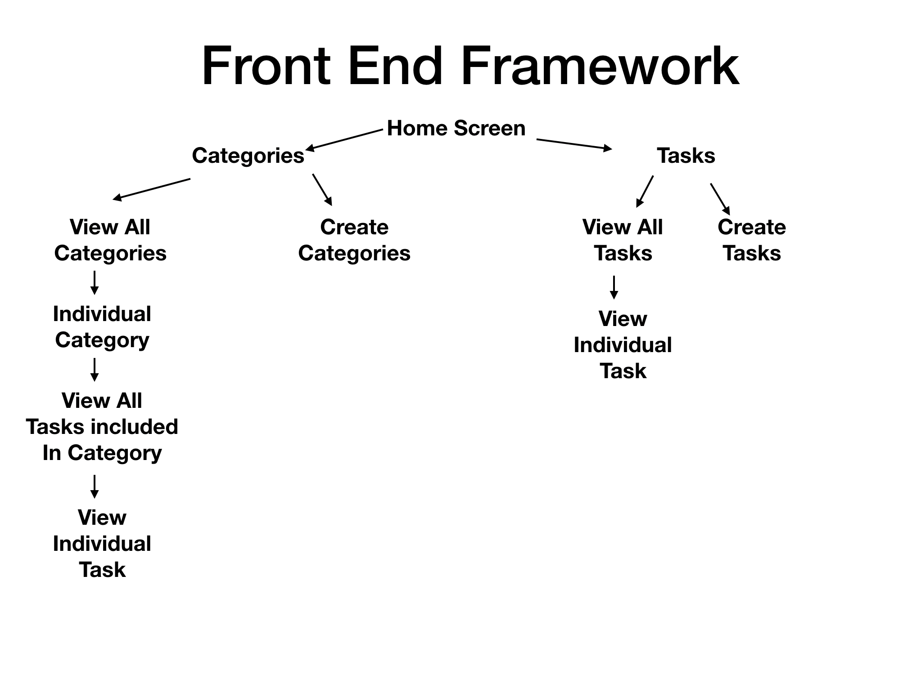

# adultingtasks-backend

## This is an app that allows users to create tasks that they feel people should know as they become adults.

## http://adultingtasks.herokuapp.com

---

##Motivation
The motivation behind this app is based on the fact that everyone can use it. Everyone ages, therefore they should be prepared to become adults. This app makes it easy for them to find steps to complete tasks that they will eventually encounter.

---

##Overall Process

I started by first building my back end. This was done via Django and postgresql. Some steps included in this process were to set up my settings.py, urls.py, models, views, and serializers.py.

The front end was created via React.js, and Bootstrap. Some of the steps for the front end included, setting up components, and app.js, and making calls to my backend.

Both front and back end were deployed to heroku.
